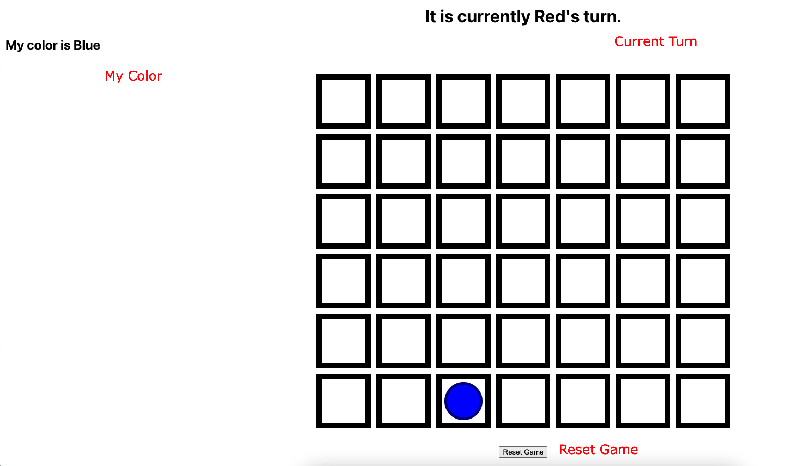

# ConnectFour Game

## How to run

### Project directories

- [frontend-ts](./frontend-ts/)
- [backend-ts](./backend-ts/)

### Stpes to run on local

```terminal
$ git clone git@github.com:lang-sky/react-node-socket-game.git && cd react-node-socket-game
```

Open 2 terminals in the project root folder

On the first terminal

```terminal
$ cd frontend-ts
$ yarn && yarn start
```

On the second terminal

```terminal
$ cd backend-ts
$ yarn && yarn start
```

## Play

Open 2 browsers(tabs) and navigate to http://localhost:3000

The page will show

- Current Turn
- My Color
- Board
- Reset Game button



### First player

First joined/start player is always Blue. The second is Red.

Now play!

## Documentation

### Real-time communication

[socket.io-client](https://www.npmjs.com/package/socket.io-client) on React and [socket.io](https://www.npmjs.com/package/socket.io) on Node have been used for real-time communication between client/server.

## Initial Requirements

### Some helpful resources for understanding the game:

- [Official Connect4 game rules](https://www.fgbradleys.com/rules/Connect%20Four.pdf)
- [Video about how to play connect 4](https://www.youtube.com/watch?v=utXzIFEVPjA)

### Given

- mockup: a static HTML site with HTML and CSS “mockup” of the application. Consider this the mockup from your teams' designer. It looks the way it’s expected to look, but it was created by a designer not a developer.
- frontend-js: A JavaScript based react “hello world” application.
- frontend-ts: A TypeScript based react “hello world” application.
- backend-js: A JavaScript based express “hello world” application.
- backend-ts: A TypeScript based express “hello world” application.

### Requirements

- Frontend must use React: https://www.npmjs.com/package/react
- Backend must use Express: https://www.npmjs.com/package/express
- Frontend and Backend must use Typescript or JavaScript (your choice)
- Solution must include a mechanism for running the frontend and backend locally
- Communication between backend and frontend must happen over HTTP (HTTP polling is OK)
- Game must support 2 players in two different browser instances playing the game against each
  other

### To save time, skip these areas

- Detecting when the game is over – the algorithm to know when the game is over is complex, skip this, assume that the two users will know when the game is over on their own and reset the game on their own using the button.
- Single player mode – We are only expecting a 2 player game, we do not expect you to implement the single player vs a Bot scenario.
- Any rules about who goes first - Just assign one of the players to go first randomly, or by who joined first, it’s not important.
- Edge cases – don't worry about what happens if 3 players try to join, don’t worry about any race conditions, don’t worry about malicious users.
- Security – we’ll talk more about ideas for securing the application in person
- UI Improvements – we are NOT expecting you to make the UI any better looking than the static
  HTML page we sent, it is much more important to have a working solution and well-organized
  readable code.
- Data persistence – if the server goes down, the game in progress will be lost, that’s OK, just use
  in-memory storage to store the game in progress. Similarly reloading the browser mid game can be ignored. We do not want you to have to configure any databases or other data storage systems.
- Scalability – this game only needs to run locally and only needs to support two users and one game at a time
- Infrastructure – the game only needs to run on local development machines, no need to figure out how to deploy this to a cloud server
